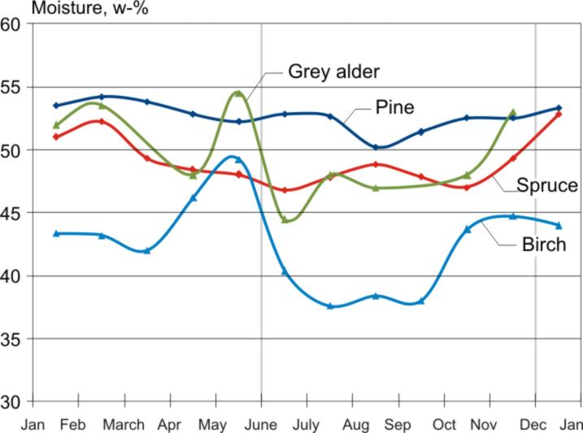
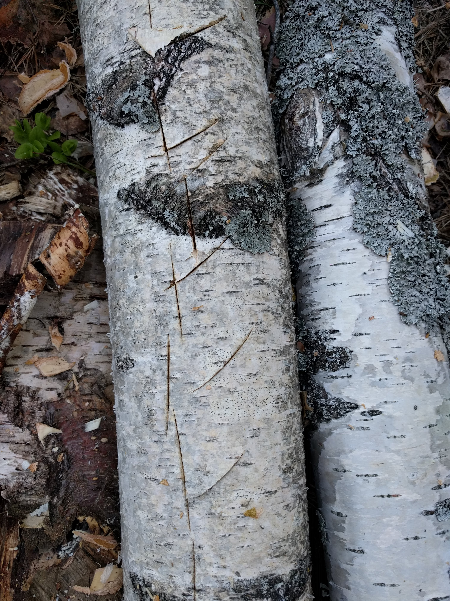
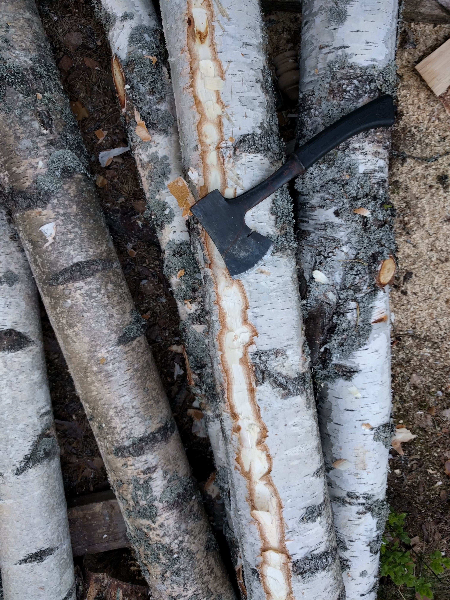
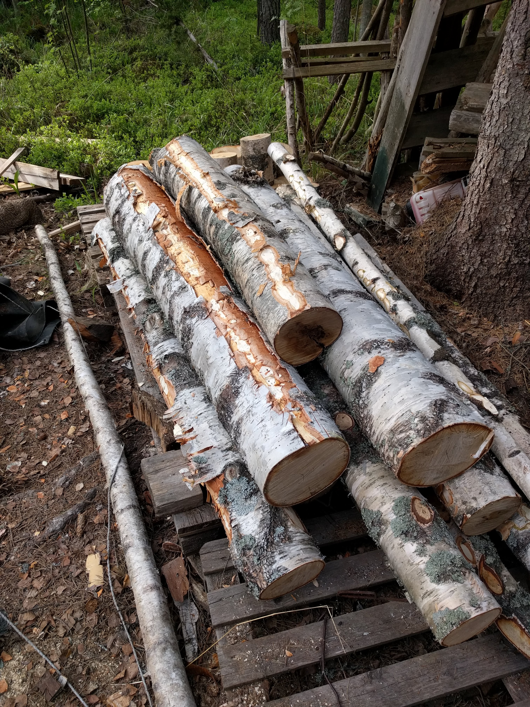
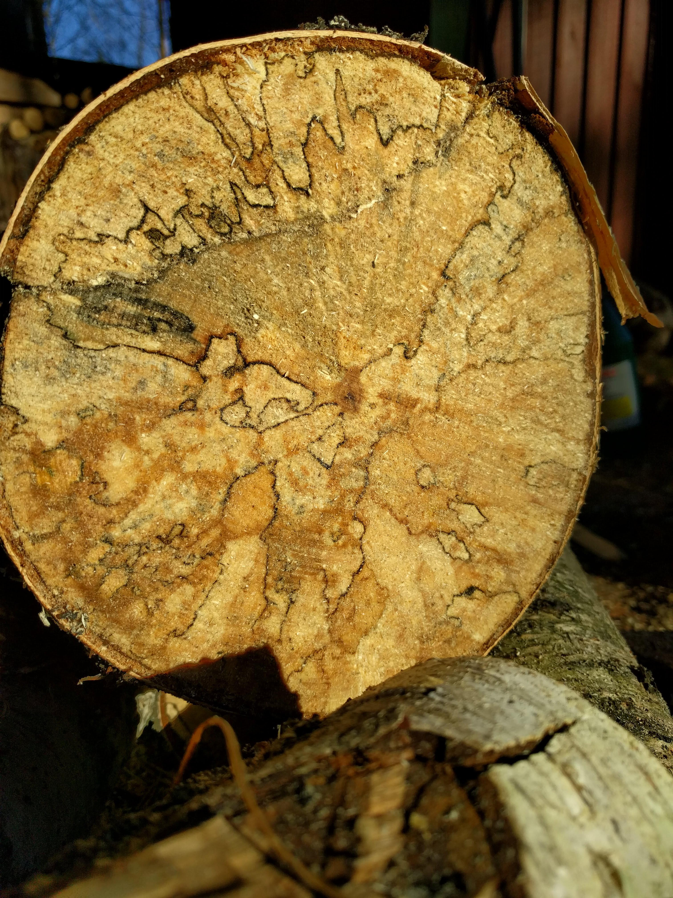

# Firewood

## Choosing Firewood and Tree species

### Type of wood
The three most common in Finnish trees have the following heat content per kilo, and density. This translates in different amounts of energy per kilo (effort of carrying) and storage space.

| Tree Species  | Scientific name          | Density  |Energy (bark)1|Energy (Stem)1| Energy (Stem+Bark)1|  Stacked wood 2|
| ------------- | ------------------------ | --------- | ---------------         | --------------          | -------------------           | --------------------      |
| Pine          | Pinus Silvestris         | 510 kg/m3 |     19.53 MJ/Kg         |    19.31  MJ/Kg         |        19.33     MJ/Kg        |     4896 – 5652 MJ/m3     |
| Spruce        | Picea abies              | 430 kg/m3 |     19.02 MJ/kg         |    19.05  MJ/Kg         |        19.02     MJ/Kg        |     4680 – 4752 MJ/m3     |
| Birch         | Betula pendula/pubescens | 670 kg/m3 |  22.52 / 22.27  MJ/Kg   | 18.61 / 18.68 MJ/Kg     |    19.15 / 19.19 MJ/Kg        |     6120 – 6516 MJ/m3     |

1 [Source](http://www.woodenergy.ie/woodasafuel/listandvaluesofwoodfuelparameters-part2/)  
2 [Source - Manual for Firewood production]()

Birch, being extremely common, is only beaten by Ash trees, Beech, Oak and Robia tress in terms of heat content. This makes birch the obvious choice for most people
in Finland, depending on the regional forest composition. But both Pine and Spruce have reasonable energy content and are suitable for use for firewood.

## Moisture content
Moisture is obviously an enemy for igniting wood, but it also presents a major
inefficiency and waste of energy.

Freshly cut wood can have up to 60% water content, depending on the time of year the
tree has been cut down, and the species of the tree. Because water does not
burn, or contribute to combustion process, a lot of energy otherwise used in the
combustion chain reaction goes to heating and evaporating the water content of
the wood.

The ideal water content of wood for burning is bellow 20%, or ideally bellow
15%.

**You can get up to 15% more heat when burning correctly dried wood.**
That translates into 15% less cutting trees, 15% less chopping and transporting
wood.

Another downside of burning moist wood, is smouldering (wood burning slowly
with smoke but no flame). This leads to accumulation of flammable residue in
the chimneys, that in worst case scenario can lead to a chimney fire

See how to properly dry and store wood bellow.

## Cutting down a Tree

### Timing & drying
As we've seen before, moisture content is a major problem when it comes to firewood.

So we want to time the cutting down trees so that we minimise their time of drying.
This means considering the following factors:

* Choose a time when the tree has the least amount of water when cut down
* Maximise the amount of summer months the wood will have to dry
* Use the tree leaves to evaporate moisture if impossible to cut the tree in appropriate schedule

The moisture content of deciduous trees (trees that shed leaves annually, like birch) peaks from April and May. These are the months after the snow has melted and the trees prepare for the rapid growth in spring. **We want to avoid these months most of all.** Note that evergreen trees differ less in moisture content throughout the year.

### Winter harvest

The best months to dry wood are the summer months (April to July). To leverage these months the most, **trees should be cut down during the winter months, stored as straight long logs, and chopped in early spring to speed up the drying process**. The look and appearance of the firewood will also be the best if this method is used (assuming the wood is sheltered from rain)

If it is not possible to chop the logs in the spring after the winter harvest, **the bark should be broken or peeled into strips**, for example with a chainsaw, during the harvesting process. This facilitates the drying during the spring.

  
  
  

### Leaf seasoning

If it not possible to harvest firewood in the winter months, or if the purpose is to produce wood for the following year, the trees can be cut down by leaf seasoning. This means cutting down trees that already have leaves and letting them dry while intact in a cleared forest.

The living leaves make the tree lose moisture content through evaporation. The tree will dry up to the saturation point of the cells (when the leaves eventually fall), which represents 27 to 30% moisture content in Finnish tree species. After the leaves fall down, the tree can be transported and chopped for further drying.

## Drying
Wood that is cut during winter, chopped in early spring (May, the latest),
and stored appropriately through a good summer can be sufficiently dry for use
in the autumn. However it is advisable that wood supplies of one year are harvested
and left to dry the previous year.

**The first factor in drying wood is exposure to air.** And for that the tree bark
is one of the main factors. Trees with their bark intact will deteriorate fast,
as the high content in moisture and low exposure will foster the growth of fungi
and other rotting agents. Decomposition will already be visible in the second summer
after the tree has been harvested.

**The second factor is weather and rain.** If not sheltered appropriately logs
will absorb rainwater, which will slowdown or even revert the drying process.
On the other hand, if sheltered too much, the covers can restrict the airflow and
be equally counterproductive.

Given these factors, and since maximising the surface area is the fastest way
to dry firewood, it is recommended to follow the winter harvest method,
chop the wood into it's final shape in early spring, and store them in an
appropriate location (see Storage), sheltered from weather.

> **Note that chopping wood with high moisture content is harder.** If
you are not in a hurry to get firewood, appropriate debarking, and cutting
logs to shorter length might be sufficient for the following year's batch.

You can tell if wood is appropriately dry if:
* There are cracks at the ends of the chopped wood pieces
* The wood is significantly lighter
* Ignites easily, and does not smoulder (smoke but no fire)

## Dry Storage

### Elevation.
The storage of wood should be elevated from the ground. This prevents
the moisture from the ground to rise, enhances air
circulation under the woodpile, and to prevent rainwater to pool around it.

Elevation can be achieved, for example, using wood pallets

### Post-chopping storage - Stacking vs Piling
Is it really worth the effort to neatly stacking wood? and if yes, how worth is it?

According to the [Manual for Firewood production](), a neatly packed
pile of wood has 68% more wood than a loose pile of the same volume.

If you are letting your logs dry in a covered area, and space is a restriction,
then **yes**.

**So far we have not found significant information regarding
drying effectiveness of stacking vs lose piles of wood**

## Chopping wood

### Old school

### The tire method

### The hammer method

## Before burn storage