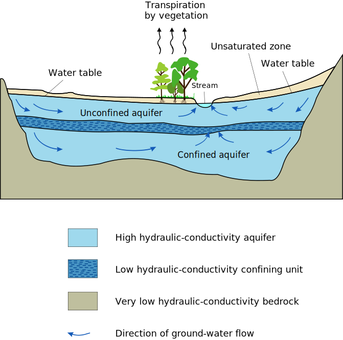
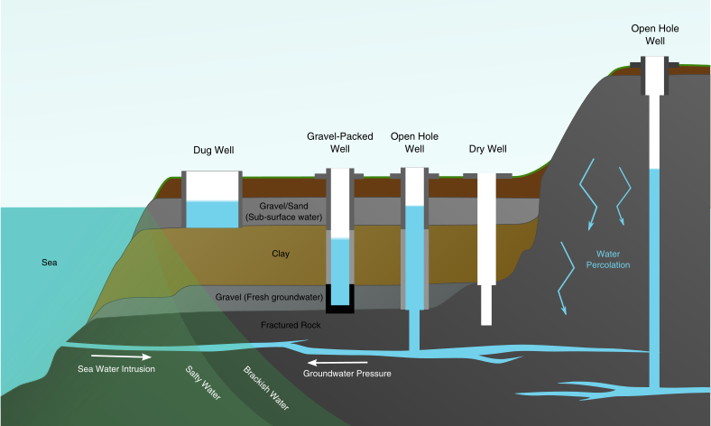

# Well
One of the most common way of getting fresh drinking water at the mokki, is to have a well.

A well is just an excavation or structure in the ground to access water, and they can
be broadly classified into one of two categories

* Shallow well (or unconfined) - If you ever dug a hole in a sandy beach, you might
have reached a point when water starts accumulating at the bottom. This is how shallow
wells work. These wells get their water from unconfined aquifers closer to the surface.
The water from rain, lakes, rivers and sea permeates the soil, creating
a layer of water saturated soil. Once a well is dug bellow the water level a pool of water
will accumulate.

* Deep wells (or confined) - If the region you're in does not have any body of water nearby, is
too high above wate level, or does not have a layer of soil to retain the water, it's likely
that no unconfined aquifer exists. However it is possible that deeper, confined aquifers exist.
These underground bodies of water, somtimes the size of countires, can be accessed with deeper
excavations.

In finland it's very common to use shallow wells, given that most mokki are located
near a lake (or at reasonable distance from one). So we'll focus on this type.

## Well placement

Wells should be build on slopes, so that water from melting snow runs away from the well. If water melts (meting first around the walls of the well), and re-freezes it can damage its structure.

Roots of big trees can also damage the structure of the well.

Given that shallow wells get their water from the surface and surrounding bodies of water, they are especially vulnerable to contamination. This means the well should be as far away from contaminating activities as possible. Here are some common contamination sources

### Pathogens

**Toilets** - Pit latrines, or toilets in which their "contents" are in direct contact with soil can run off and permeate the soil, effectively contaminating the surrounding unconfined aquifer with dangerous bacteria/algae or promoting their growth with nutrients.

**Gargening, agriculture and composting (fertilizers)** - Fertilizers pose a similar threat as the toilets. Nitrogen
rich fertilizers promote the growth of bacteria and algae, which can pose a health threat. Storage of
these materials is also problematic.

### Chemicals
**Workshops and storage** - In workshops and storage it is common to use or store paints, solvents, and other dangerous substances that can fall to the ground and permeate the soil into the aquifer.

**Car parking** - Cars and other veichels leak. If there is a oil / battery leak it can contamine the surrounding aquifer for the years to come

**Gardening, agriculture (pesticides)** - Usage or storage of pesticides should be avoided for the
same reasons.

In genral avoid actitities with pollutants around the well, and place the well as far away
from as possible from these areas.

## Maintenence and prevention

### Don't
* Don't open the lid of your well. It is very likely that materials will fall in to the well, and contaminate it.

* Avoid inserting foreign objects into the well. Use a pump installed by a professional, and avoid using buckets that might be dirty.

* Don't pile snow or laves close to the well

### Dos

* **Before winter** - Check that there are no depressions around the well that could accumulate melted snow. If water accumulates and re-freezes it can damage the structure of the well.

* **Before and after winter** - Check the lid of the well to ensure it closes properly, and that no materials can get in (eg. dead leaves, small animals). Check ventilation pipes to ensure they are clean and unobstructed.

* **After winter** ensure there are no problems created by ice and snow melting. Carefully vaccum clean the ventilation pipe, and clean the lid and surroundings of the well from branches and dead leaves.

* **After winter** Empty the well fully after winter before use. This way new and fresh ground water will be available.

* **Every couple of years (during summer)** do a home kit water test. Some contaminants might be tastless, odorless, and invisible to the naked eye. If anyone who uses the water well has recurrent gastro-intestinal issues, the
water should also be tested.

* **Every 5-7 years** contact a professional to do well maintenece and cleaning. It might involve flushing the well (add clorine or other desinfectant, and subsequencially empty the well).

---

By Confuciou - Own work, CC BY 3.0, https://commons.wikimedia.org/w/index.php?curid=8667102
