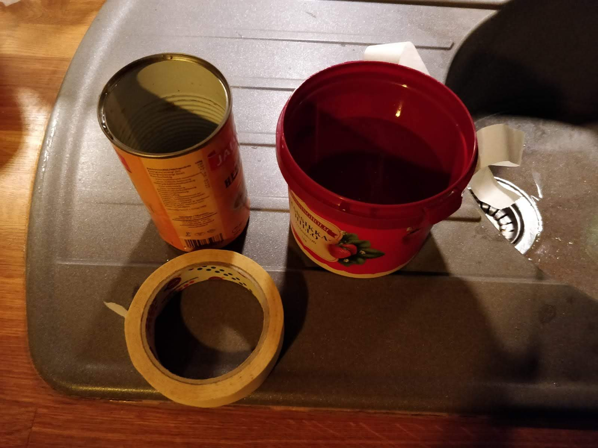
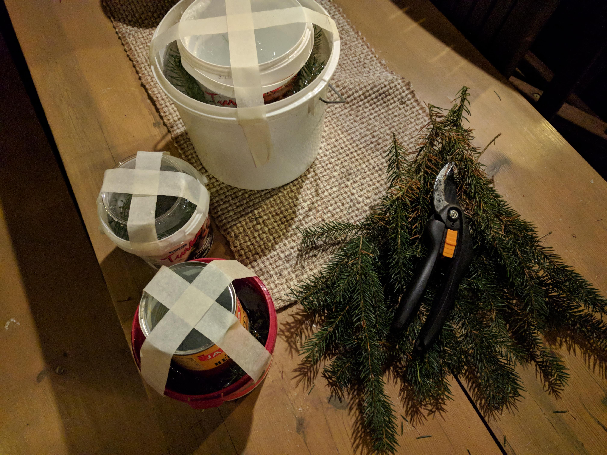
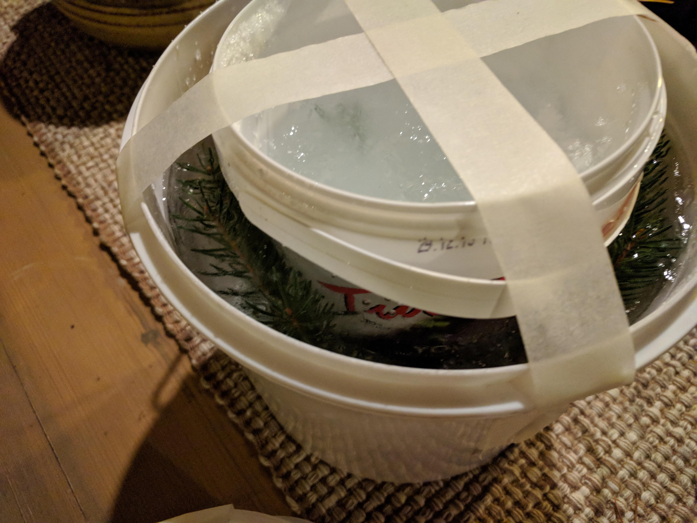
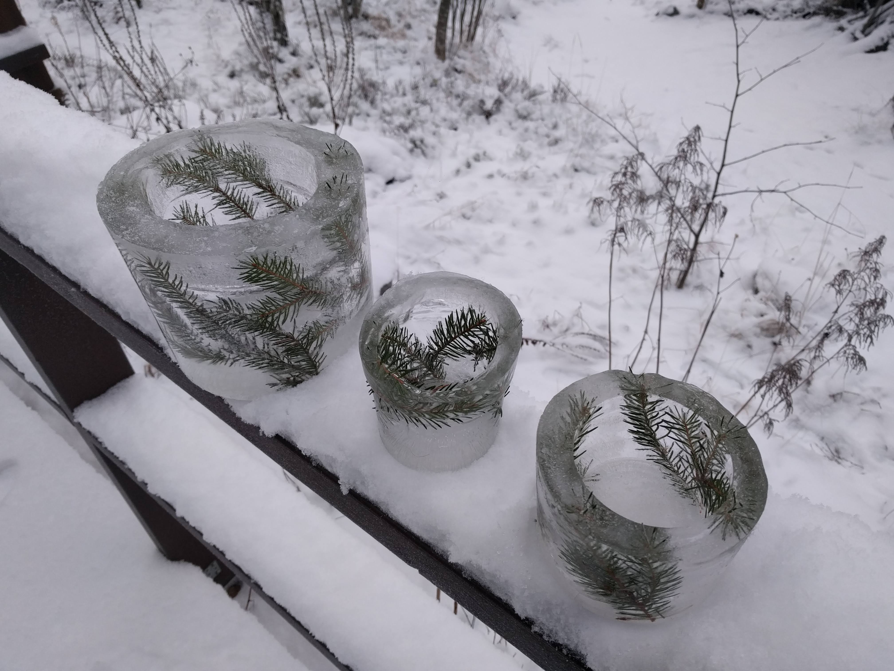
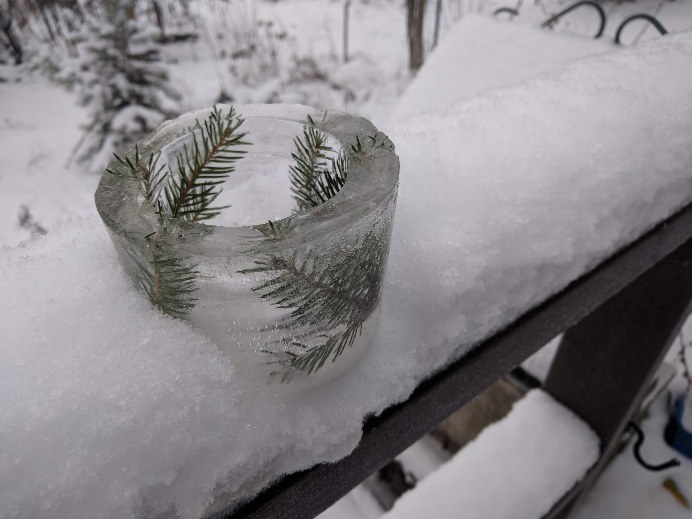

# Ice Lanterns

Snow and Ice lanterns are not a tradition exclusive from Finland, the Nordics or Scandinavia. Places
like Japan also have this tradtion, with the city of [Hirosaki having an anual snow latern festival](https://en.wikipedia.org/wiki/Harbin_International_Ice_and_Snow_Sculpture_Festival).

But some sources point to the tradition of making snow lanterns in honour of fallen soldiers of WW2, during 
the 1940s in Finland. Since it's a common traddition to visit loved one's graves during the Christmas season, 
it is plausible that it migh have became a Christmas tradition of itself.

Regardless, it is a really nice activitiy to bring a bit of light to the darkness of winter, specially 
during Christmas.

## Lumilyhty - Snow lanterns

***IMAGE***

In order to make a snow lanter, the snow conditions need to be favorable to making snow balls - Ideally 
nuoska type - packing snow (See snow types). If it's too cold and the snow is too dry the snowballs 
won't hold. 

Make snowballs of a reasonable size and lay them on the ground in a circle with a bit of space in between.
Add new layer of snowballs in a "chess" like pattern, while leaning the balls closer to the center the higer 
you go.
```
  O O 
 O O O
O O O O
```
After the desired height has been achieved place candles inside the lantern

## Jäälyhty - Ice Lanterns

### Easy method
The easiest way to make an Ice lantern is to use 2 buckets, a large and smaller one.

- Fill the larger bucket with water up to 2/3rds. 
- Insert the smaller pucket into the larger one and fill with water or weithgs untill it has a reasonable
distance from the bottom of the large bucket. 
- With ducktape make an X shape on top of the two buckets to keep the small bucket in place
- Optionally add decorative material (such as spruce branches and pine branches)

<p float="left">
  
  
  
</p>


<p float="left">
  
  
</p>

### Single bucket
An alternative method is to use a metal bucket (or less ideally a plastic one), fill it with water, 
and periodically verify the thickness of the ice. Ensure the core of the water stays liquid.

After a couple of hours, or overnight, remove the ice from the bucket, gently break the top thin 
layer of ice and empty the water on the inside.

This works best with metal because the thermal conductivity of the metal is much greater than air or plastic,
leading to the water to freeze from the walls of bucket towards the inside of the bucket faster. 
A plastic bucket works as well, but it will likely take longer, and have a larger ice layer on top of the bucket, which will have to be removed with a tool. This process needs to be done carefully in order not to break the newly
created lantern


### Spherical ice lanterns
Spherical lanterns can be achieved similarly to the the Single bucket method, but with a ballon instead of a 
bucket. Fill a balloon with water and air. Leave the baloon outsite for long enough for ice to form in the ballon,
but short enough so the water at the center remains liquid. 

Puncture the balloon at the top where the air was left, and remove the ballon and the liquid water at the center.


## Note on clear Ice
Some people claim that the way to make clear ice is to boil the water before freezing. That is not accurate.
Ice that is not clear has frozen unevenly - eg from outsite towards the inside. When the inside water freezes while being contained in the outside ice it expands in volume. Having nowhere to go it cracks the already formed outside ice. Air disolved in that water also has nowhere to go, so it ends up trapped in the inside ice making white instead of transparent. 

The **only** solution to making clear ice is to ensure that the water freezes evenly (eg. from top to bottom of a container). This can be achieved by isolating the container on all sides except one, and having only that area exposed to cold. This has the disadvantage of taking significanltly longer to freeze a whole container. 
